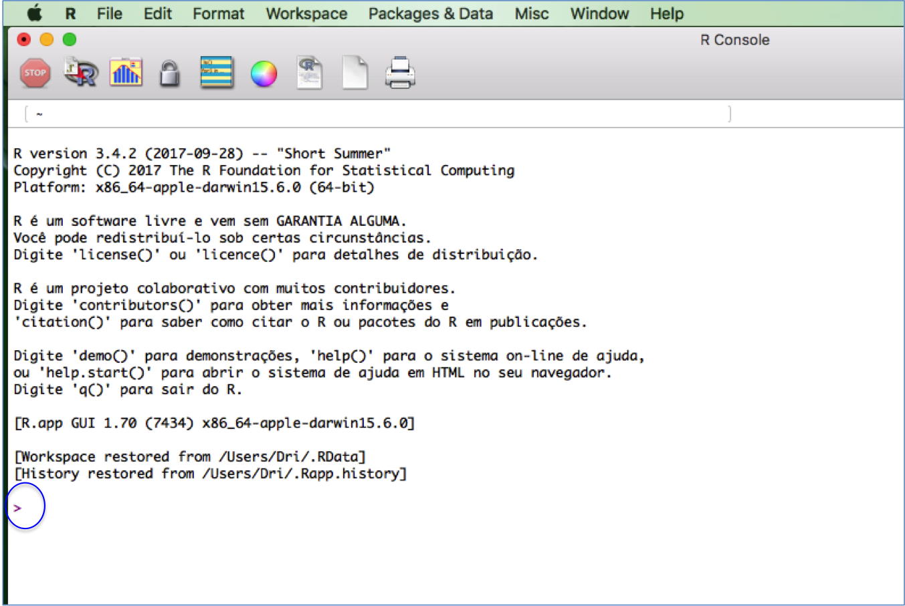
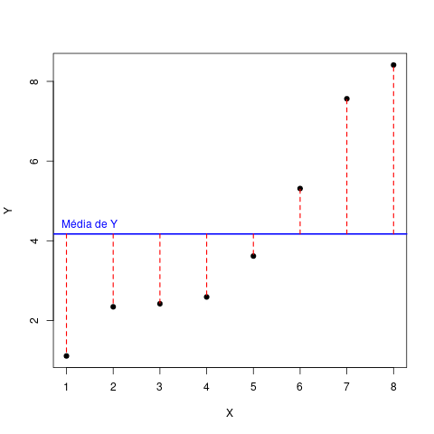
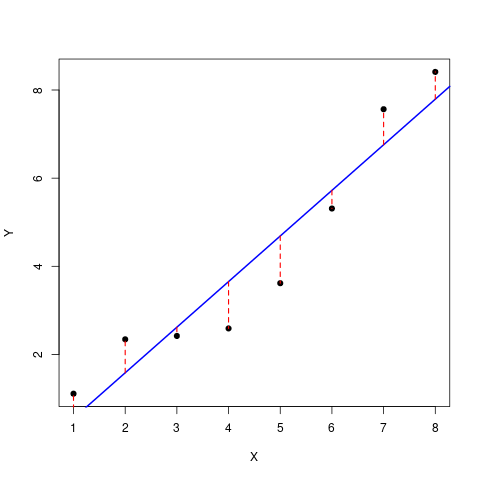

```{r settings, echo=FALSE}
library(knitr)
```


# Introdução

O coeficiente de determinação ($R^2$) expressa a proporção da variação
de uma medida (variável resposta) que é explicada pela variação de
outra (variável explanatória). Se supomos que a variação é explicada
por uma relação linear, os cálculos são simples e ajudam muito a
entender a lógica da partição da variação que está por trás do $R^2$.

Neste roteiro vamos usar a regressão linear e um conjunto pequeno de
dados para entender o coeficiente de determinação.

## Preparação para o exercício

Abra o programa R, clicando no ícone que está na área de trabalho do
seu computador: 

Se tudo deu certo até aqui, abrirá uma janela do R como essa:



O símbolo ">", circundado em azul na imagem, indica o início da linha
de comando ou **prompt**, onde você deve escrever comandos para o R.


Copie e cole o comando abaixo na
linha de comando do R, para carregar os dados que vamos usar:

```{r importa-dadinhos}
dadinhos <- read.csv("https://raw.githubusercontent.com/piklprado/BIE-0320/main/data/dadinho.csv")
```

Se não houve nenhuma mensagem de erro agora você tem no R uma tabela
com 8 linhas e duas colunas, que explicaremos a seguir. Se quiser
verificar se a tabela foi importada, digite o nome dela no R


```{r mostra-dadinhos, eval=FALSE}
dadinhos
```

# Cálculos passo a passo

## A variação total

Nosso ponto de partida é a variação de uma variável, no caso Y. Uma
das maneiras mais usadas na estatística para expressar a variação de
medidas é sua dispersão em torno da média. Para isso, calculamos a
diferença de cada medida à média de todas as medidas. Vamos adicionar
isto à nossa tabela de dados:

```{r , echo=FALSE}
dadinhos$dif <- dadinhos$Y - mean(dadinhos$Y)
```

```{r , eval=FALSE}
dadinhos$dif <- dadinhos$Y - mean(dadinhos$Y)
dadinhos
```

Visualmente o que fizemos foi calcular a distância de cada ponto à
média de todos os pontos, que está representada como uma linha
horizontal azul:




Para resumir estas distâncias em um único número, as elevamos ao
quadrado e somamos. Isso é chamado "soma dos desvios quadrados" ou
simplesmente "soma dos quadrados".

Por que elevar ao quadrado os desvios à média? Bom, primeiro porque a
soma dos desvios (sem elevar ao quadrado) é sempre zero... Mas também
porque a soma dos desvios ao quadrado tem várias propriedades
estatísticas úteis, como a aditividade que vamos ver em seguida.

A soma dos quadrados descreve a variação **total** da
variável Y. Calcule esta soma no R com o comando a seguir, e guarde em
uma objeto chamado `V.total`:

```{r }
V.total <- sum(dadinhos$dif^2)
```

Lembre-se que para ver o valor que vc obteve e armazenou neste objeto,
basta digitar o nome do objeto na linha de comando:

```{r , eval=FALSE}
V.total
```

## A variação que sobra da regressão

Uma regressão linear busca explicar a variação observada em uma
variável (resposta) pela variação de outra (preditoras ou
explanatórias). Se a regressão é bem sucedida, esperamos que deixe
pouca variação sem explicação. Chamamos de **variação residual** da
regressão a parte da variação total que não é explicada pela
regressão. Esta variação residual é a soma dos quadrados dos desvios
de cada ponto à linha de regressão.

Na figura a seguir está a linha da regressão linear de Y em função de
X, e os desvios de cada observação em relação a esta reta de
regressão. Veja que resíduos da regressão são bem menores que os
desvios em relação à média, da figura anterior. Ou seja, a regressão
de fato explica uma parte da variação dos dados, deixando como não
explicada uma fração menor desta variação.



Como descobrimos o valor dos resíduos na figura? E como os usamos para
calcular a variação residual da regressão? Vamos calcular passo a
passo. Primeiro ajustamos a regressão:


```{r }
dadinhos.lm <- lm(Y ~ X, data=dadinhos)
```

Os intercepto e a inclinação da equação da reta ajustada são:

```{r, echo=FALSE }
dadinhos.cf <- coef(dadinhos.lm)
```

```{r, eval=FALSE }
(dadinhos.cf <- coef(dadinhos.lm))
```

E agora adicionamos à nossa planilha de dados os valores de Y
previstos pela equação da reta para cada valor de X:

```{r }
dadinhos$Y.pred <- predict(dadinhos.lm)
```

e também adicionamos a diferença entre os valores de Y e os previstos,
que são os resíduos da regressão:

```{r }
dadinhos$residuo <- dadinhos$Y - dadinhos$Y.pred
```

Nossa tabela de dados agora tem cinco colunas:

```{r , echo=FALSE}
kable(dadinhos)
```

A soma dos quadrados dos resíduos expressa a variação que restou da
regressão. É a variação de Y que não é explicada pela variação de X,
em uma regressão linear. Para calculá-la somamos os valores da coluna
dos resíduos, elevados ao quadrado:

```{r }
V.resid <- sum(dadinhos$residuo^2)
```

E vemos que de fato essa variação residual é bem menor que a total:

```{r, eval=FALSE }
V.resid
```

## A variação explicada pela regressão

Acima calculamos a variação total de Y e a variação que resta em Y
depois de considerarmos que Y é, em média proporcional a X ^[Ou seja,
que o valor esperado de Y é uma função linear de X]. A soma dos
quadrados, medida que escolhemos para expressar estes componentes de
variação, tem uma propriedade muito útil. Se consideramos o efeito
linear de X como a única fonte de explicação para Y, podemos então
dizer que:

$$V_{total} = V_{explic} + V_{resid} $$

ou seja, que a soma dos quadrados total (variação total) é o resultado
da adição da soma dos quadrados explicados (pela regressão) e da soma
dos quadrados dos resíduos da regressão. Em outras palavras, estamos
repartindo, ou **particionando aditivamente** a variação total de Y em
dois componentes. Este raciocínio pode ser generalizado para mais
componentes de variação, como veremos em um próximo roteiro.

Como já calculamos $V_{total}$ e $V_{resid}$, podemos obter a variação
explicada pela regressão com:

$$V_{explic} =  V_{total} - V_{resid} $$

Que podemos calcular no R usando os valores acima, que armazenamos:

```{r , echo=FALSE}
V.expl <-  V.total - V.resid
```


```{r , eval=FALSE}
(V.expl <-  V.total - V.resid)
```

## E finalmente o coeficiente de determinação!

Obtemos o coeficiente de determinação dividindo $V_{explic}$ por $V_{total}$:

```{r , eval=FALSE}
V.expl/V.total
```

Esse coeficiente de determinação é o famoso $R^2$ das regressões lineares!

Neste caso dizemos que `r round(100*V.expl/V.total,1)`% da variação de Y é
explicada por X. Nada mal. Mas o que você poderia esperar de dados que
a gente mesmo criou, né!

