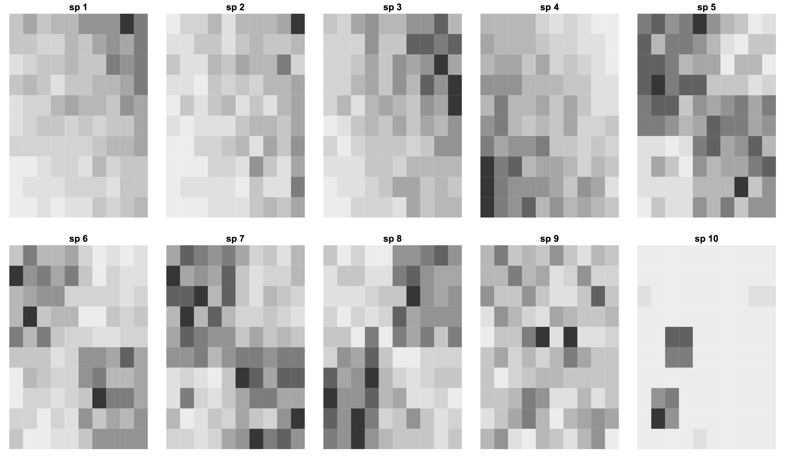
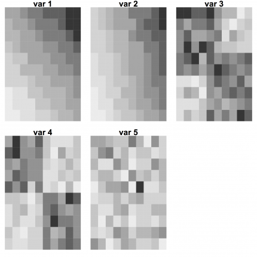

# Estrutura de Comunidades

Três aspectos essenciais da estrutura das comunidades são a riqueza de
espécies, a composição de espécies e suas abundâncias. Um dos grandes
desafios em ecologia é avaliar o grau de similaridade entre
comunidades em relação a esses três aspectos e entender quais os
principais fatores que determinam os padrões observados.

Uma das técnicas utilizadas para quantificar a importância relativa de
diferentes fatores é **Partição da Variação**. A ideia geral é que a
abundância de diferentes espécies varia no espaço, e que há padrões
que nos dão pistas sobre processos que organizam as comunidades. Por
exemplo, os mapas a seguir respresentam a densidade de 10 espécies de
plantas em cada uma das 100 quadrículas de uma parcela. As quadrículas
mais escuras têm maior densidade das plantas e as mais claras menor
densidade.

Você percebe padrões nos mapas acima? Se há padrão, queremos uma
explicação! Imagine que você tenha também mapas de medidas de cinco
variáveis de solo importantes para as plantas, em cada quadrícula :

Parece haver relação entre os dois mapas? O objetivo da particão da
variação é avaliar essas relações. Ou seja, estabelecer relações entre
padrões espaciais das espécies, e destas com outras variáveis do
ambiente. Feito isso, é possível quantificar quanto da variação de
abundância das espécies foi captada, ou explicada, pelas variáveis
ambientais.

## Particão passo a passo
A partição da variação  pode ser aplicada
para cada espécie separadamente ou para a comunidade como um
todo. Nesta prática, vamos começar entendendo e aplicando a técnica de
partição da variação para apenas uma espécie e depois vamos aprender
como generalizar a análise para a comunidade, utilizando técnicas de
**Análises Multivariadas**.

Para fazer a prática, siga os seguintes roteiros:

  - [Coeficiente de determinação](coeficiente_determinacao.html), o
    conceito que está na base da partição de variação;
  - [Partição de variação com uma espécie](particao_univariada.html), em que a ideia é
    apresentada para o caso mais simples de uma espécie e uma variável
    preditora por vez.
  - [Particão de variação multivariada], que mostra como a análise
    pode ser feita para dados de muitas espécies e muitas variáveis
    preditoras de uma vez.
