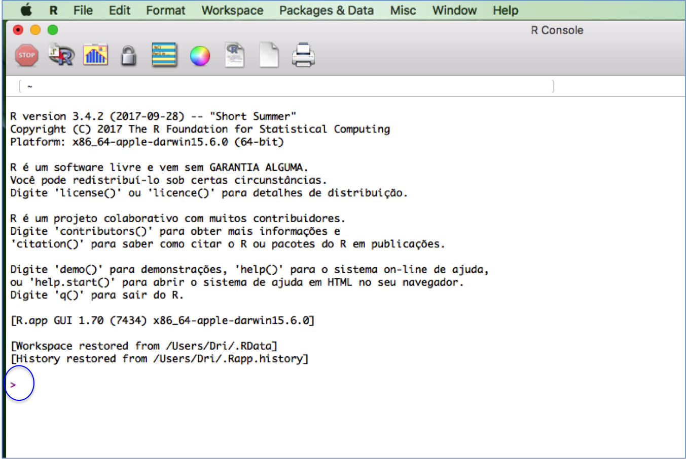

```{r settings, echo=FALSE}
library(knitr)
knitr::opts_chunk$set(
  echo = TRUE, eval = FALSE)
```


# Introdução

## Preparação para o exercício

Abra o programa R, clicando no ícone que está na área de trabalho do
seu computador: 

Se tudo deu certo até aqui, abrirá uma janela do R como essa:



O símbolo ">", circundado em azul na imagem, indica o início da linha
de comando ou **prompt**, onde você deve escrever comandos para o R.


Copie e cole o comando abaixo na linha de comando do R, para carregar
o pacote (biblioteca de funções) que vamos usar:

```{r }
library(spatstat)
```
## Alguns modelos de distribuição de pontos em um plano

### Poisson homogêneo

O primeiro modelo que vamos usar é chamado **Poisson homogêmneo**, e
descreve pontos distribuídos ao acaso e de forma independente em uma
área. Execute os comandos abaixo para simular um padrão de pontos gerados
por este processo Poisson Homogêneo, em uma área quadrada de 1x1.

```{r  Poisson homogeneo}
## Gera o padrão de um processo PH, com intensidade = 100
PH <- rpoispp(lambda = 100, win = unit.square())
## Plota o padrão de pontos
plot(PH)
```

A função que simula o processo chama-se `rpoispp`. Ela tem o argumento
`lambda`, que é a **intensidade** do processo, que é a densidade média
de pontos por unidade de área. Depois de gerar os pontos, o código
abaixo usa a função `plot` para fazer um gráfico do padrão de
pontos. Experimente executar os comandos acima com outros valores de
intensidade, para verificar o que muda no padrão de pontos gerados
pelo modelo.


Como a intensidade do padrão que geramos inicialmente é 100 e a área é
um quadrado de 1x1, o valor **esperado** de pontos nesta área é
de 100. Isso não quer dizer que em toda simulação teremos exatamente
esta quantidade de pontos, e sim que em que o número médio de pontos
é 100. Ou seja, se repetirmos várias vezes a simulação deste processo,
a média das densidades de todas as simulações corresponde à
intensidade do processo.

A figura abaixo mostra nove repetições do padrão Poisson
Homogêneo. O número de pontos em cada simulação está escrito acima de
cada gráfico.

```{r  Poisson homogeneo media, echo = FALSE}
## Nove simulações do modelo
HP1 <- rpoispp(lambda = 100, win = unit.square(), nsim = 9)
## Plota os nove graficos
par(mfrow = c(3,3))
sapply(HP1, function(x)(plot(x, main = paste0("N = ", x$n))))
par(mfrow = c(1,1))
```

### Poisson não-homogêneo

Este é um modelo de distribuição de pontos ao acaso, mas com uma
intensidade que varia no espaço. Para exemplificar, vamos imaginar que
em metade da nossa área quadrada de 1x1 a intensidade do processo é
$\lambda = 20$, e na outra metade a intensidade é de $\lambda =
180$. Execute os comandos abaixo para simular um padrão Poisson não
homogêneo com estas intensidades:

```{r  Poisson nao homogeneo}
## Aqui definimos uma funcao que descreve como a intensidade muda na area
## No caso, a itensidade muda de 180 para 20 a partir do valor da coordenada X = 0.5
padrao1 <- function(x,y) ifelse(test = x > 0.5, yes = 20, no = 180)
## Gera o padrão de pontos
IP <- rpoispp(lambda = padrao1, win = unit.square())
## Plota o grafico
plot(IP1)
## Uma linha para marcar as duas regiões
abline(v = 0.5, lty =2 , col = "blue")
```

Um dos usos do modelo Poisson Não-Homogêneo é descrever a variação na
densidade de plantas sob diferentes condições ambientais. Um exemplo
pode ser a maior densidade de uma espécie de planta em áreas de menor
altitude. Para ilustrar, vamos usar o mapa de altitude do terreno
na parcela Permanente de Barro Colorado, no Panamá. Esta é uma área de
500 x 1000m, na qual todas as árvores acima de 1 cm de diâmetro são
monitoradas desde 1983.

O comando abaixo mostra o mapa de altitude da parcela. A escala de cor
mostra a altitude acima do nível do mar, em metros.

```{r  BCI altitude}
image(bei.extra$elev, main = "Elevação do terreno em BCI")
```

Agora vamos criar uma função que descreve um aumento da intensidade do
Processo Poisson com a redução da altitude, de forma exponencial. Os
números foram escolhidos para obtermos uma quantidade razoável de
pontos neste exemplo. 

Em seguida, vamos criar um padrão de pontos com
o modelo Poisson Não-Homogêneo, com esta função de intensidade. Com
isso, simulamos uma espécie fictícia que tem maiores densidades nas
àreas mais baixas:

```{r  BCI planta ficticia}
## Valores de intensidade em funcao da elevacao
padrao2 <- exp(20 - bei.extra$elev/10)*5e-6
## Gera padrão de pontos com a intensidade definida acima
bci.pp <- rpoispp(lambda = padrao2)
## Plota o mapa do terreno e os pontos
image(bei.extra$elev, main = "Elevação do terreno em BCI")
points(bci.pp)
```

### Modelo Thomas Homogêneo


```{r  Thomas homogeneo}
TH <- rThomas(kappa = 10, scale = 0.01, mu = 10, win = unit.square())
plot(TH)
```
O parâmetro `kappa` da função define a intensidade de agrupamentos, ou
seja, a densidade esperada de agregados. Veja o o que acontece se
dobramos esta intensidade:

```{r  Thomas homogeneo varia kappa}
## Nova simulacao com kappa = 20
TH2 <- rThomas(kappa = 20, scale = 0.01, mu = 10, win = unit.square())
## Plota o grafico anterior junto com o grafico do novo padrao
par(mfrow=c(1,2)) ## abre janela para dois graficos juntos
plot(TH, main = "Kappa = 10")
plot(TH2, main = "Kappa = 20")
par(mfrow = c(1,1))
```
Use os comandos acima para descobrir o que os parâmetros `scale` e
`mu` da função no R fazem. Por exemplo, você pode aumentar o valor de
`scale` em relação à primeira simulação assim:

```{r  Thomas homogeneo varia scale}
## Nova simulacao com scale = 0.04
TH3 <- rThomas(kappa = 10, scale = 0.03, mu = 10, win = unit.square())
## Plota o grafico anterior junto com o grafico do novo padrao
par(mfrow=c(1,2)) ## abre janela para dois graficos juntos
plot(TH, main = "scale = 0.01")
plot(TH3, main = "scale = 0.03")
par(mfrow = c(1,1))
```
Agora tente fazer a comparação reduzindo o valor de do parâmetro `mu`.

### Modelo de Thomas não-homogêneo

```{r  Thomas  nao homogeneo}
padrao3 <- function(x,y) ifelse(x > 0.5, 2, 18)
IT <- rThomas(kappa = padrao3, scale = 0.01, mu = 10, win = unit.square())
plot(IT)
abline(v = 0.5, lty =2 , col = "blue")
```

```{r  L de Ripley}
LTH1 <- Lest(TH1)
LIP1 <- Lest(IP1)
plot(LTH1, iso-r ~ r)
plot(LIP1, iso-r ~ r, add=TRUE)

## Poisson homogeneo
HP2 <- rpoispp(lambda = 100, win = unit.square(), nsim = 100)
LHP2 <- lapply(HP2, Lest)
plot(LHP2[[1]], iso~r)
abline(0,1, col="blue")
plot(LTH1, iso-r ~ r,  main="")
lapply(LHP2, plot, add = TRUE, iso-r~r, col="gray")
plot(LIP1, iso-r ~ r, add = TRUE)
## Envelopes
HP1.e <- envelope(HP1[[1]], Lest,nsim=39)

## To set common limits
a <- plot(HP1.e, . -r ~ r, limitsonly=TRUE)
b <- plot(LTH1, iso-r ~ r, limitsonly=TRUE)
xlim <- range(a$xlim, b$xlim)
ylim <- range(a$ylim, b$ylim)
##
plot(HP1.e, . -r ~ r, legend = FALSE, main = "", xlim = xlim, ylim = ylim)
plot(LTH1, iso-r ~ r, add = TRUE)
## Xarada:
TH2 <- rThomas(kappa = 10, scale = 0.1, mu = 20, win = unit.square())
plot(TH2)
plot(envelope(TH2, Lest, nsim =100), .-r ~r, legend=FALSE) 
```


