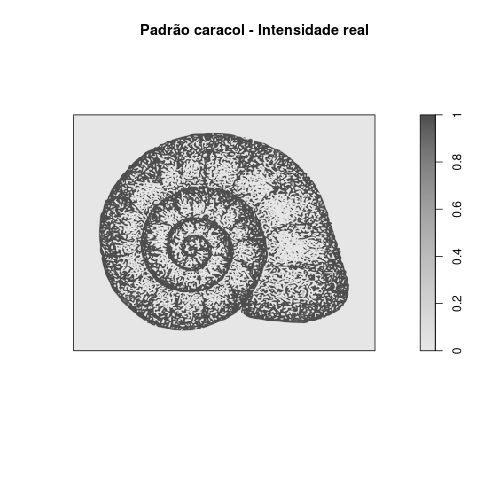
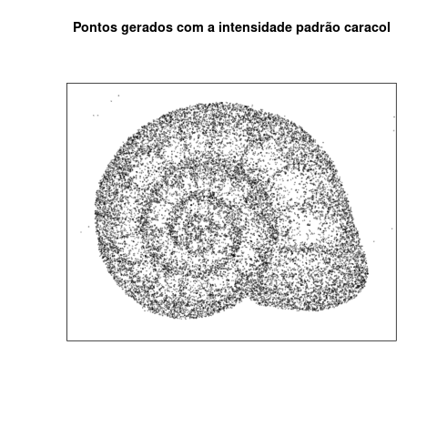
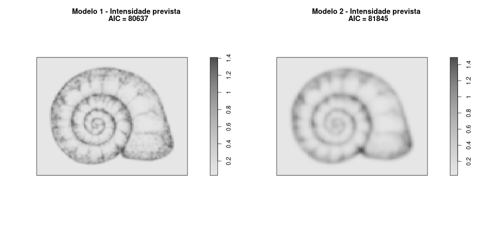

```{r settings, echo=FALSE}
library(knitr)
knitr::opts_chunk$set(echo = TRUE, eval = FALSE)
library(spatstat)
## descomente para gerar com todos os outputs
##knitr::opts_chunk$set(echo = TRUE, eval = TRUE)
```

# Introdução

No roteiro anterior, vimos como a função de L de Ripley pode ser usada
para avaliar se um padrão de distribuição de pontos no espaço
corresponde ao esperado por um processo Poisson homogêneo. Neste
roteiro, vamos generalizar esta ideia, mostrando duas maneiras pela
qual podemos avaliar o ajuste de qualquer modelo de distribuição de
pontos a um padrão espacial.


# Ajuste de modelos a padrões de pontos no espaço

Nesta seção, vamos comparar o desempenho dos modelos Poisson homogêneo
e não-homogêneo para prever a intensidade de um padrão de pontos no
espaço. São pontos de localização de uma espécie de planta fictícia,
em uma área de 100 x 100 metros. Começamos carregando o padrão e
fazendo o gráfico deste padrão:

```{r }
## Carrega a biblioteca de analises espaciais
library(spatstat)
## URL dos dados que vamos usar
URL <- "https://github.com/piLaboratory/BIE-0320/raw/main/data/"
## Carrega primeiro padrao de pontos
p1 <-
    paste0(URL, "EP_roteiro3_padrao1.csv") |> 
    read.csv() |>
    as.ppp( W = owin(c(0,100), c(0,100), unitname = "m"))
## Plota o padrão
plot(p1, main = "Padrão 1")
```

## Modelo Poisson Homogêneo

O palpite mais simples para um padrão destes é que os pontos estão
distribuídos ao acaso. Se isso é verdade, um modelo **Poisson
homogêneo** deve descrever bem o padrão. A única informação de que
precisamos para ajustar este modelo aos dados é a **intensidade** do
processo, ou seja, a densidade média dos pontos na área. Não sabemos o
valor real da intensidade que gerou o padrão, mas podemos tentar um
palpite informado pelos dados. Ou seja, podemos **estimar** a
intensidade, a partir dos dados. Ao fazer esta estimativa, dizemos que
**ajustamos o modelo aos dados**. No pacote do R que usamos, a função
`ppm` faz o ajuste de um modelo Poisson homogêneo com o comando:

```{r ajuste PH p1}
p1.m1 <- ppm(p1)
```

O resultado deste ajuste é a estimativa da intensidade do processo,
em escala logarítmica. O comando a seguir exibe este valor:


```{r log int PH p1}
(cf1 <- coef(p1.m1))
```

Portanto, o valor estimado da intensidade pelo modelo Poisson
Homogêneo é a exponencial deste valor :


```{r int PH p1}
exp(cf1)
```

Que é simplesmente a densidade de plantas por $m^2$ na área. Podemos
verificar isso pedindo o resumo numérico dos pontos:


```{r resumo p1}
summary(p1)
```

Ou seja, o modelo Poisson homogêneo estima uma intensidade constante
por toda a área, que corresponde à densidade observada de pontos. Mas
será que este é um bom modelo para estes dados? Uma maneira de avaliar
isso é comparar os valores da função L de Ripley esperada pelo modelo
Poisson Homogêneo com os valores desta função obtidas dos pontos. Os
comandos abaixo usam o modelo que ajustamos para fazer isso, e exibir
o gráfico que compara os valores de L de Ripley:


```{r p1 m1 L Ripley}
## Calcula a funcao L e seus envelope de confianca
p1.m1.L <- envelope(p1.m1, fun = Lest)
## Plora o grafico obs e esperado pelo modelo
plot(p1.m1.L, . -r ~ r, ylab = "L de Ripley",
     legend=FALSE, main = "Padrão 1 - Modelo Poisson Homogêneo")
```

A linha preta mostra os valores de L calculados para o padrão de
pontos, e a linha vermelha os valores de L previstos pelo modelo. A
área cinza mostra o intervalo de confiança de 95% dos valores de L
esperados pelo modelo. Os valores da função L para os pontos estão
acima do esperado para distâncias maiores que cerca de 2m. Isto indica
que cada planta tem mais vizinhas a estas distâncias do que o esperado
pelo modelo. Em outras palavras, as plantas não estão distribuídas ao
acaso, mas agregadas.

## Modelo Poisson não-homogêneo

O que pode estar acontecendo? Uma possibilidade é que a intensidade
não é constante, mas varia pela área. Assim, as plantas estariam
agregadas em algumas regiões da área, mesmo que isso não seja tão
fácil de perceber no mapa de pontos.

Vamos supor que a ecóloga que fez esta pesquisa propôs que a matéria
orgânica no solo poderia aumentar a sobrevivência dessas plantas. Uma
previsão desta hipótese é que áreas com mais matéria orgânica deveriam
ter maior densidade de plantas. Para verificar essa previsão, ela e
sua equipe dividiram a área em parcelas de 1x1 m , e mediram o
conteúdo de matéria orgânica do solo em cada parcela. Os comandos
abaixo carregam o mapa resultante:


```{r p1 MO}
## Carrega os dados de M.O. na área
MO.solo <-
    paste0(URL,"EP_roteiro3_solo.txt") |> 
    read.table() |>
    as.matrix() |>
    as.im( W = owin(c(0,100), c(0,100)), eps=1 )
## Plota o mapa
plot(MO.solo, main = "% de M.O. no solo superficial")
```

Para testar a hipótese da intrépida ecóloga, podemos ajustar um modelo
em que a intensidade do processo é uma função do conteúdo de matéria
orgânica. Este é um **modelo Poisson não-homogêneo**, que ajustamos
aos dados com o comando abaixo, no R:

```{r ajusta IP p1}
p1.m2 <- ppm(p1 ~ MO.solo)
```

Este modelo ajusta uma relação matemática entre a intensidade do
processo e o conteúdo de matéria orgânica[^1] . A forma dessa relação é
mostrada com os comandos a seguir:


```{r plot lambda x MO p1 IP}
## Coeficientes do modelo
(cfs <- coef(p1.m2))
## Plota a relacao entre intensidade e MO prevista pelo modelo
curve(exp(cfs[1] + cfs[2]*x), 20,70, main = "Padrão 1 - Intensidade prevista Poisson não-homogêneo",
      ylab = "Intensidade / m2", xlab = "% M.O. solo superficial")
```

Outra maneira de entender o ajuste do modelo é pelo mapa das
intensidades previstas. O comando abaixo desenha este mapas
intensidade por $m^2$ previstas e sobrepõe o padrão de pontos:


```{r p1 IP previstos}
plot(predict(p1.m2), main = "Padrão 1 -  previsto Poisson não-homogêneo")
points(p1)
```

Será que estas previsões descrevem melhor o padrão de pontos?
Novamente, usamos a função L de Ripley para avaliar se o modelo estima
números de vizinhos compatíveis com os observados:


```{r p1 IP L Ripley}
## Calcula o envelope da funcao L
p1.m2.L <- envelope(p1.m2, fun = Lest)
## Plota o grafico
plot(p1.m2.L, . -r ~ r, ylab = "L de Ripley",
     legend=FALSE,
     main = "Padrão 1 - Modelo Poisson não-homogêneo")
```

A linha da função L prevista pelo modelo coincide muito bem com a
linha da função L calculada com os pontos, para todos os raios de
distância. Este resultado confirma a previsão de que a densidade das
plantas aumenta com o conteúdo de matéria orgânica do solo. Portanto,
corrobora a hipótese de que há uma associação da planta com hábitats
mais ricos em matéria orgânica.

## Critério de informação de Akaike

Até aqui usamos a função L de Ripley para comparar os modelos
que ajustamos. Este é um procedimento que funciona para modelos de
padrões de pontos. Uma outra maneira para comparar modelos, que funciona para
qualquer modelo estatístico, é o **Critério de informação de Akaike**,
ou **AIC**. Muito resumidamente, o AIC expressa quanta informação do
processo que gerou os dados foi perdida quando ajustamos um modelo. 

Todo modelo é uma aproximação e, portanto, perde alguma informação do
processo que gera os dados. Ainda assim, alguns modelos podem perder
menos informação. Podemos ver isto calculando o AIC de cada modelo que
ajustamos acima, com estes comandos:


```{r p1 AICs}
## AIC do modelo Poisson homog.
AIC(p1.m1)
## AIC do modelo Poisson não-homog.
AIC(p1.m2)
```

O AIC do ajuste Poisson não-homogêneo é menor do que o AIC do ajuste
Poisson homogêneo. Ou seja, o modelo Poisson não-homogêneo preserva
mais informação do processo que gerou o padrão de pontos. Desta forma,
temos outro critério para justificar nossa preferência por este
modelo.

### Um pouco mais sobre o AIC

Vamos tentar deixar mais clara esta ideia de perda de informação pelo modelo. 
Considere que todo modelo é uma descrição de um processo, a
partir de observações incompletas desse processo. E que o modelo tenta
recuperar o processo, a partir destas informações parciais ou
incompletas. Para ilustrar, imagine um processo que gera pontos
no espaço, que tem uma intensidade expressa por este mapa:

<center>

</center>

Lembre-se que nunca temos acesso ao padrão real, apenas a observações
(ou "realizações") do processo. Neste caso, as realizações do processo
espacial são padrões de pontos. Então vamos supor que este processo
tenha gerado o padrão de pontos abaixo:

<center>

</center>

Por fim vamos usar dois modelos Poisson não-homogêneos 
ajustados a estes pontos, usando diferentes variáveis preditoras[^2].  As
intensidades previstas por cada um destes modelos, e seus
respectivos valores de AIC, são estes:

<center>

</center>

O modelo 1 preservou mais informação do processo que gerou os dados,
por isso tem um valor de AIC **menor**. Aqui sabemos que isso é
verdade porque geramos um padrão de pontos de um processo conhecido,
com o computador, de uma maneira que a perda de informação fica
evidente até para nossa visão. O AIC é útil porque sempre "enxerga"
essa perda de informação, o que nos dá um critério geral para comparar
modelos estatísticos.


[^1]: Mais especificamente, este modelo ajusta uma relação exponencial
    do tipo $\lambda = e^{a_0 + a_1 X}$, em que $\lambda$ é a
    intensidade do processo, $X$ é a variável preditora ou
    independente (no caso o conteúdo de matéria orgânica) e $a_0$ e
    $a_1$ são os coeficientes da função, cujos valores é estimado pela
    rotina de ajuste do modelo.

[^2]: Não se preocupe com o que sejam estas variáveis, pois o
    argumento não depende disto, apenas de considerar que uma
    preditora é melhor do que a outra.
