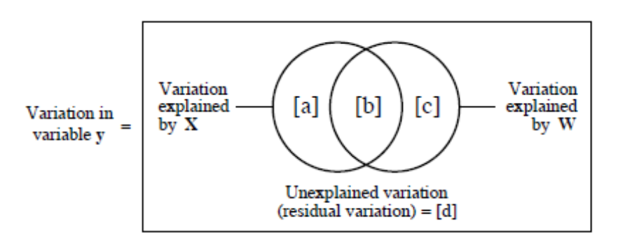

```{r settings, echo=FALSE}
library(knitr)
```

# Introdução

Os três parâmetros estruturais básicos das comunidades são a riqueza,
composição e abundância (de espécies, tipos funcionais, linhagens
...).  Uma das abordagens da ecologia de comunidades é buscar
regularidades nestes parâmetros estruturais, e propor explicações para
eles. Neste roteiro vamos aprender uma das ferramentas estatísticas
usadas para isto, chamada partição de variação.

Aqui vamos analisar a estrutura espacial da abundância de uma espécie
fictícia. Começamos com apenas uma espécie porque isso facilita
entender os cálculos e suas interpretações. No roteiro seguinte
mostraremos como a partição pode ser generalizada para descrever
padrões conjuntos de abundância de muitas espécies.

## Preparação

Para fazer este roteiro você precisa ter feito antes o roteiro sobre
[coeficiente de determinação](coeficiente_determinacao.html).

Para começar, abra o R e cole o comando abaixo na linha de comando e
pressione *"Enter"*:


```{r}
dados <- read.csv2("https://raw.githubusercontent.com/piklprado/BIE-0320/main/data/roteiro1.csv")
```

Se não houve nenhuma mensagem de erro agora você tem no R uma tabela
com 100 linhas e três colunas, que explicaremos a seguir. Se quiser
verificar se a tabela foi importada, você pode usar os comandos
seguintes para mostrar suas primeiras e últimas linhas:

```{r , eval=FALSE}
head(dados)
tail(dados)
```

# Em busca de uma estrutura

A abundância de uma espécie pode variar muito, no tempo e no espaço. A
pergunta fundamental aqui é o que causa esta variação. A partição de
variância é um método para avaliar o quanto da variação de uma
quantidade pode ser atribuída à variação de uma outra
quantidade. Usamos este método para avaliar se é plausível que a
abundância de uma planta em uma área varie em função da variação de um
fator ambiental, por exemplo.

### Um padrão

Vamos aos nossos dados, para deixar mais concreto. A figura abaixo
representa uma parcela permanente, que foi dividida em 100
quadrados. Em cada quadrado foram contados todos os indivíduos de
*Non illum*, uma erva daninha invasora. A abundância da planta por
quadrado vai de dois indivíduos (cinza claro) até 41 indivíduos (cor
preta).


## Uma hipótese: variação ambiental

Percebendo a concentração de plantas no canto superior direito da
parcela, uma ecóloga propôs a hipótese de que a planta tem uma
associação com solos menos ácidos. Ela chegou a esta hipótese porque
havia medido o pH do solo superficial em cada parcela, o que usou para
fazer o mapa a seguir (à direita). Neste mapa, cores claras são
valores mais baixos de pH e cores escuras valores altos.


Parece razoável? Para avaliar melhor isto vamos fazer um gráfico da
relação entre a abundância da planta e o valor do pH em cada
parcela. Já importamos estes dados para o R na seção anterior, então
temos só que executar um comando no R para ver o gráfico:

```{r , eval=FALSE}
plot(abund ~ pH, data = dados)
```

O gráfico sugere que a abundância da planta é proporcional ao pH. Se
isso é verdade, deve haver uma linha reta que aproxime bem esta
relação. A **regressão linear** é uma técnica estatística para
encontrar esta reta. Execute no R o comando para ajustar a regressão
da abundância em função do pH:

```{r }
regr.pH <- lm(abund ~ pH,  data = dados)
```

E adicione a linha da regressão ao seu gráfico com

```{r , eval=FALSE}
abline(regr.pH)
```

### A variação explicada pela hipótese

A regressão linear nos retorna muita informação importante sobre a
relação que hipotetizamos. A que mais nos interessa agora é o
**coeficiente de determinação**, expresso pela sigla $R^2$. Este
coeficiente expressa a proporção da variação total da variável
resposta (a abundância, no caso) que é "capturada" ou "explicada" pela
variação da variável explanatória (o pH, no caso)^[Para entender o
$R^2$ veja [o roteiro sobre coeficiente de
determinação](coeficiente_determinacao.html)].

Para obter o $R^2$ da regressão que ajustamos acima basta executar o  comando:

```{r, echo=FALSE }
X<-summary(regr.pH)$r.squared
```

```{r, eval=FALSE }
(X<-summary(regr.pH)$r.squared)
```
O que mostra que `r round(X*100,1)`% da variação da abundância da espécie é explicada por uma relação linear com o pH do solo superficial.

Com este comando também guardamos o valor obtido em uma objeto chamado ''X''.


## Outra hipótese: limitação à dispersão

Uma outra ecóloga sabia que a invasão por *Non illum* era recente e
havia começado pelo canto superior direito da parcela por sementes
trazida acidentalmente por tucanos, que desapareceram em seguida ^[ao
que parece tucanos e patos amarelos dispersam apenas uma vez as
sementes, pois morrem envenenados por elas].  A ecóloga então propôs
que quadrados mais distantes do ponto de entrada tiveram menor chance
de serem colonizados. Esta hipótese propõe que a variação da
abundância desta planta observada na parcela é resultado apenas da
limitação à dispersão. A ecóloga criou então um mapa para expressar
sua hipótese. Neste mapa (à direita) os quadrados com maior chance de
receber propágulos estão em tons mais escuros:


Este é mapa é construído atribuindo um valor a cada quadrado, que deve
expressar um índice de abundância relativa aos demais quadrados. No
caso, este índice pode ser interpretado como proporcional à
probabilidade de estabelecimento de um propágulo. A limitação à
dispersão se expressa pelo arranjo espacial de áreas com alta e baixa
probabilidade de estabelecimento, de acordo com algum modelo de
dispersão ou estabelecimento. Neste caso o modelo é bem simples:
quanto mais distante do vértice superior direito, menor a chance de
estabelecimento. Por isso vamos chamar o índice usado para construir o
mapa de **variável de estrutura espacial**.

Compare o mapa da direita com o mapa de variação da abundância da
planta (esquerda). Será que a limitação à dispersão proposta é uma boa
hipótese? Para ajudar, faça o gráfico da abundância em função da
variável de estrutura espacial com o comando:

```{r , eval=FALSE}
plot(abund ~ space, data= dados, xlab = "Variável de estrutura espacial", 
      ylab= "Abundância de Non ilum")
```


### Teste da hipótese de limitação à dispersão

Para testar esta nova hipótese ajustamos a regressão da abundância em
função da variável espacial:

```{r }
regr.space <- lm(abund ~ space, data = dados)
```

E podemos adicionar a linha da regressão ao gráfico:

```{r , eval=FALSE}
abline(regr.space)
```

### Variação explicada pela hipótese de limitação à dispersão

Obtemos a fração da variação da abundância explicada pela variável
espacial com o comando que já conhecemos, aplicado ao objeto que
guarda os resultados da regressão:

```{r , echo=FALSE}
W <- summary(regr.space)$r.squared
```

```{r , eval=FALSE}
(W <- summary(regr.space)$r.squared)
```

## Partição da variação entre ambiente e espaço

Resumindo o que encontramos até aqui: uma variável ambiental (pH)
explica `r round(X*100, 1)`% da variação da abundância da espécie. Mas
uma variável de estrutura espacial explica `r round(X*100, 1)`% desta
mesma variação. Como é possível que a soma dos percentuais de variação
explicada passem de 100% ?

A resposta é que há uma relação entre o pH e a variável de estrutura espacial:

```{r, eval=FALSE }
plot(pH ~ space, data = dados, xlab = "Variável de estrutura espacial")
```

O que significa que **a variável ambiental tem uma estrutura
espacial**, que é bem descrita pela estrutura espacial proposta pela
segunda hipótese. Assim, a variação explicada pelo pH contém uma parte
de efeito espacial. Da mesma forma, uma parte da variação explicada
pela variável espacial contém efeito do pH.

A esta parte da variação compartilhada chamamos **variação ambiental
estruturada no espaço**. No esquema abaixo esta parte da variação
explicada é o componente $b$.



O círculo da esquerda representa a variação explicada por uma variável
$X$, no caso a variável ambiental. Vemos que a variação explicada por
$X$ é a soma do mesmo componente compartilhado $b$ com um componente
$a$ que chamamos **fração de variância explicada apenas pelo
ambiente**.

Da mesma forma, o círculo da direita representa a variação explicada
por uma segunda variável $W$, no caso o espaço. Vemos que $W$ é
formado pelo componente compartilhado com a outra variável ($b$) e por
uma outra fração $c$, que chamamos de **fração de variância explicada
apenas pelo espaço**.

Por fim, variação total é representada pelo
retângulo. A parte não coberta pelos círculos é a variação que não é
explicada por nenhuma variável, indicada por $d$.


### Variação não explicada

A variação não explicada por nenhuma variável é obtida da regressão que inclui todas as variáveis:

```{r }
regr.tudo <- lm(abund ~ pH + space, data = dados)
```

De onde obtemos a variação explicada pelo pH e a variável espacial juntas:

```{r, eval=FALSE }
summary(regr.tudo)$r.squared
```

Esta quantidade corresponde a $a+b+c$ no diagrama acima, que vamos chamar de $XW$. Sabendo que 

$$a+b+c+d\ = \ XW + d \ = \ 1$$ 

temos então que 

$$d = 1 - XW$$. 

Assim, obtemos $d$ subtraindo o valor acima de um:

```{r , echo=FALSE}
d <- 1 - summary(regr.tudo)$r.squared
```

```{r , eval=FALSE}
(d <- 1 - summary(regr.tudo)$r.squared)
```

### Juntando as peças

Agora temos todas as peças que precisamos para calcular como a
variação da abundância de *Non illum* pode ser particionada entre os
componentes do diagrama acima:


$$
\left\{ 
\begin{array}{l}
a + b = X \\ 
c + b = W\\ 
a + b + c = 1 - d 
\end{array}
\right. 
$$

O que implica em

$$ d + X + W -1 = b$$


Usando os valores que já calculamos e guardamos no R temos então:

**Fração devido a espaço e pH ($b$):**

```{r, eval=FALSE }
(b <- X + W + d - 1)
```

**Fração devido apenas a pH ($a$):**
```{r , eval=FALSE}
(a <- X - b)
```

**Fração devido apenas a espaço ($c$):**
```{r , eval=FALSE}
(c <- W - b)
```

**Fração não explicada ($d$):**
```{r , eval=FALSE}
d
```

# A pergunta sobre a vida, o universo e tudo mais

Qual hipótese tem mais apoio dos resultados?


